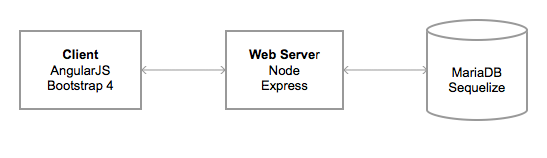

# Dark Blue Redux #
Your challenge: collect all the yellow pellets without fail!


## How to Play ##
```
<-- move right
--> move left
 x  jump
```
Play the game now --> http://spiritphyz.io:8080

## How to Vote ##
- Click 'Up Vote' or 'Down Vote'
- Click 'Save Votes' to record the tallies

## Tech Stack ##
As a demonstration of a full-stack web app, the site allows voting on your favorite maps. The votes are stored and persistently loaded from the server.



The site is deployed on [Digital Ocean](https://www.digitalocean.com) with Ubuntu 16.04. Originally, it was deployed on [Linode](https://www.digitalocean.com) with [CentOS 7](https://en.wikipedia.org/wiki/CentOS), a derivative of Red Hat Enterprise Linux.

### Front End ###
- AngularJS for interactive elements
- Bootstrap 4 for a CSS framework
- [FontAwesome](http://fontawesome.io) icons (Bootstrap 3's glyphicons are no longer available)
- [Arcade](http://www.urbanfonts.com/fonts/Arcade.htm) and [superscript](http://www.urbanfonts.com/fonts/superscript.htm) pixel fonts
- Pure [CSS spinner](http://stephanwagner.me/only-css-loading-spinner) by Stephan Wagner
- Adobe Photoshop for graphic illustrations and favicon
- [screengif](https://github.com/dergachev/screengif) and QuickTime Player for animated GIF graphic

### Back End ###
- [Node](https://nodejs.org/en/) & [Express](http://expressjs.com)
- [Sequelize](http://docs.sequelizejs.com/en/v3/) ORM
- [MariaDB](https://en.wikipedia.org/wiki/MariaDB) (a community version of MySQL)

### Credits ###
The game is from Chapter 15 of [Eloquent JavaScript](http://eloquentjavascript.net/15_game.html), which is inspired by [Dark Blue](http://www.lessmilk.com/games/10), created by Thomas Palef.

I made slight tweaks to the game code, which is stored at [Dark Blue Redux Core](https://github.com/spiritphyz/Dark-Blue-Redux-Core).

Dark Blue Redux is a demonstration of a MVP (Minimal Viable Product) whose main components were created over a period of 2 days.
